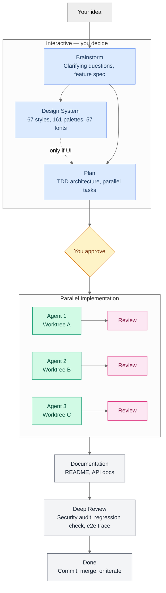
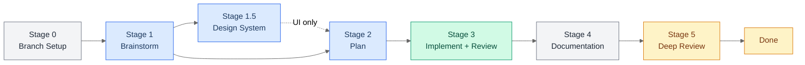
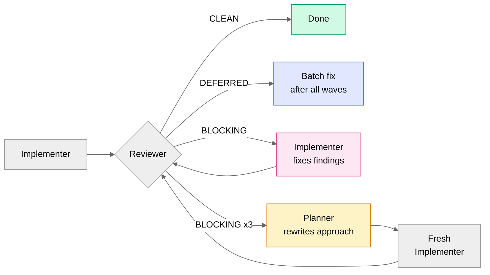
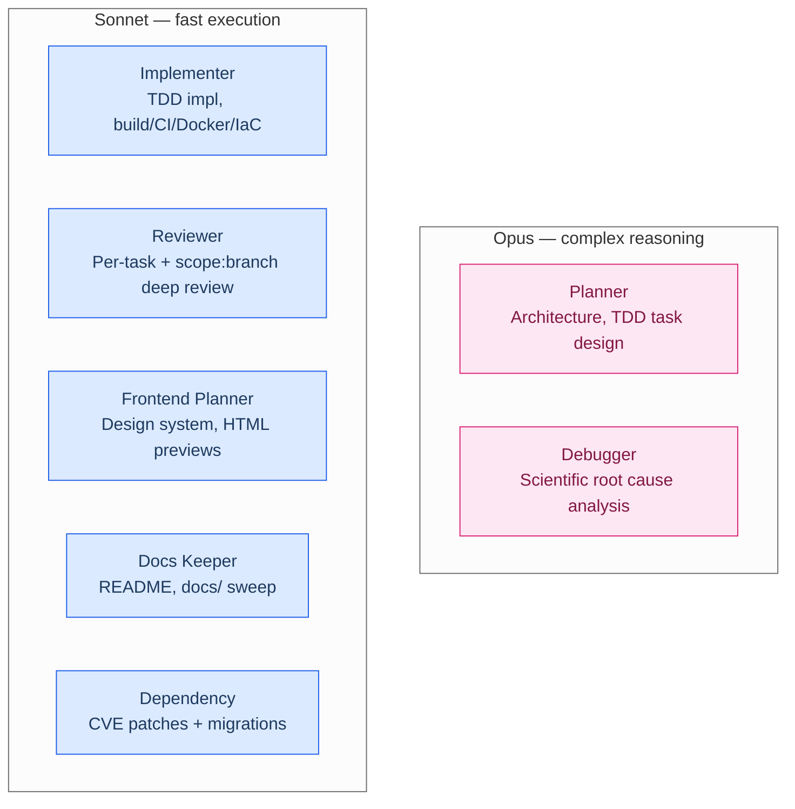
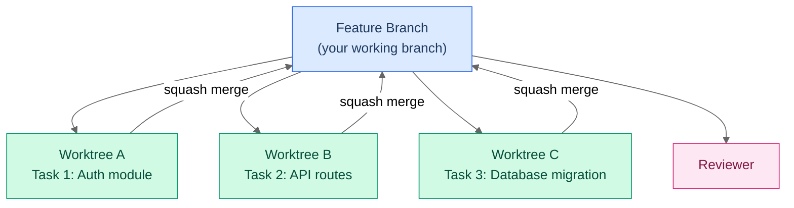

# devline

A Claude Code plugin that turns a rough idea into merge-ready code. It brainstorms scope, plans a TDD architecture, implements tasks in parallel worktrees, reviews every line, updates your docs, and runs a final security audit. You approve twice (after brainstorm, after plan) and get working code back.



Every finding from every review gets fixed. There's no "pass with warnings." If an implementer can't fix it after two attempts, the planner rewrites the approach.

---

## Install

### Quick install

```bash
curl -fsSL https://raw.githubusercontent.com/Conava/claude-devline/main/install.sh | bash
```

Installs Claude Code (if missing), the devline plugin, and the recommended companions (RTK, Ponytail, Basic Memory). Works on **Linux** (apt/pacman/dnf/zypper/apk), **macOS** (Homebrew), and **Windows via WSL or Git Bash** — it prompts before installing any missing underlying tool. Review the script first if you like. Flags: `--minimal` (devline only), `--skip-rtk`/`--skip-ponytail`/`--skip-memory`, `--yes` (non-interactive). Example: `curl -fsSL https://raw.githubusercontent.com/Conava/claude-devline/main/install.sh | bash -s -- --minimal`.

### From the marketplace

```bash
claude plugin marketplace add Conava/claude-devline
claude plugin install devline@devline
```

### From source

```bash
git clone https://github.com/Conava/claude-devline.git
claude --plugin-dir ./claude-devline
```

Then run `/devline:setup` in your project. It creates a `CLAUDE.md` (project context for agents) and a `.claude/devline.local.md` (pipeline settings) through an interactive walkthrough.

### Requirements

- Claude Code with plugin support
- `jq`, `git`, [`gh`](https://cli.github.com/)
- Recommended: `export CLAUDE_CODE_MAX_OUTPUT_TOKENS=128000` in your shell profile. The frontend designer and other agents produce large outputs (HTML previews, design systems). The default 32K limit will cut them off.

### Permissions

Devline is built for `--dangerously-skip-permissions` mode. Agents need to read files, write code, and run builds without prompting on every tool call.

Safety comes from hooks, not permission dialogs. The plugin ships ~19 focused security rules that block irreversible or destructive operations before they execute. Force pushes, `rm -rf` outside the working dir, credential exposure, publishing commands, database destructive operations -- all blocked. See [Security Hooks](#security-hooks).

```bash
claude --dangerously-skip-permissions
```

It works without bypass mode too. You'll just get prompted frequently during parallel implementation.

---

## Recommended companions

Optional, but they make devline leaner and more capable — `/devline:setup` offers to install all three. The [quick installer](#quick-install) sets up all three automatically, and wires Basic Memory through a per-session MCP wrapper so parallel Claude sessions each bind to their own repo's `memory/` project (multi-session-safe).

- **[RTK](https://github.com/rtk-ai/rtk)** — a CLI proxy that filters command-output noise for 60-90% token savings. devline runs many parallel agents issuing Bash commands, so it compounds.
  ```bash
  curl -fsSL https://raw.githubusercontent.com/rtk-ai/rtk/refs/heads/master/install.sh | sh
  rtk init -g
  ```
- **[Basic Memory](https://github.com/basicmachines-co/basic-memory)** — local-first, per-project memory stored as plain Markdown you commit to the repo, retrieved on demand so it never bloats context. Persistent cross-session recall in any Claude Code session, not just devline.
  ```bash
  uv tool install basic-memory
  claude mcp add basic-memory -- uvx basic-memory mcp
  ```
- **[Ponytail](https://github.com/DietrichGebert/ponytail)** — a separate Claude Code plugin that keeps generated code minimal (YAGNI, stdlib-first, shortest working diff). It composes with devline: devline enforces the process, ponytail keeps the code it produces lean.
  ```
  /plugin marketplace add DietrichGebert/ponytail
  /plugin install ponytail@ponytail
  ```

---

## Commands

| Command | What it does |
|---------|-------------|
| `/devline <idea>` | Full pipeline -- brainstorm through deep review |
| `/devline:brainstorm <idea>` | Refine an idea into a feature spec |
| `/devline:plan <spec>` | Create a TDD implementation plan |
| `/devline:implement` | Implement tasks from an existing plan |
| `/devline:quick <task>` | Fast lane -- implement, review, and commit a small change |
| `/devline:review` | Code review of recent changes |
| `/devline:debug <error>` | Systematic root cause analysis |
| `/devline:deep-review` | Final merge-readiness audit (runs the reviewer at `scope: branch`) |
| `/devline:deps [--migrate] <CVEs \| package>` | Patch CVEs, or migrate a major version with `--migrate` |
| `/devline:design` | Standalone component or theme design |
| `/writing` | Write, edit, or translate text — anti-AI-pattern rewriting for general text; citation contract enforcement for scientific writing |
| `/brand` | Brand voice, visual identity, messaging |
| `/graphic-design` | Logos, icons, banners, slides, corporate identity |

---

## How the Pipeline Works

Seven stages. Two require your input (brainstorm, plan). The rest run autonomously.



<details>
<summary><strong>Stage 0: Branch Setup</strong> (automatic)</summary>

Reads branching config from `.claude/devline.local.md`. If you're on a protected branch (main, master, develop, release, production, staging), it creates a feature branch using your configured format (default: `feat/your-feature-name`). Sets up the `.devline/` working directory and adds it to `.gitignore`.

If a previous pipeline left artifacts behind, it detects them and asks whether to resume or start fresh.

</details>

<details>
<summary><strong>Stage 1: Brainstorm</strong> (interactive)</summary>

Focuses on what you're building and where it fits -- not implementation details. Asks 1-4 structured questions with selectable options (scope, behavior, platform, aesthetics), then writes `.devline/brainstorm.md` capturing scope, architecture impact, UI impact, and key decisions.

For larger features, the brainstorm detects natural phase boundaries and splits the work into sequential phases. Each phase gets its own plan later.

You approve the spec before anything else happens.

</details>

<details>
<summary><strong>Stage 1.5: Design System</strong> (interactive, conditional)</summary>

Triggers only when the brainstorm identifies UI impact. The frontend-planner searches a curated database (not LLM generation -- actual CSV data with BM25 ranking) and generates HTML previews you can open in a browser to compare directions.

The database:
- 67 visual styles (glassmorphism, brutalism, material design, etc.)
- 161 color palettes matched to industries
- 57 font pairings with Google Fonts imports
- 161 industry rules with do/don't patterns
- 160 animated component patterns

After you pick a direction, it writes `.devline/design-system.md` with color tokens, typography scale, animation timing, and accessibility checklist.

</details>

<details>
<summary><strong>Stage 2: Plan</strong> (interactive)</summary>

The planner reads the brainstorm and design system, traces execution paths through your codebase, and produces a TDD plan with:

- **Parallel tasks with file-based isolation.** Each task owns specific files. No merge conflicts between same-wave tasks.
- **Dependency graph.** Wave 1 tasks run in parallel. Wave 2 waits for Wave 1 to finish. And so on.
- **Feature-goal tests.** The final wave includes an E2E test that proves the feature works end-to-end.
- **Integration contracts.** Observer notifications, lifecycle hooks, state propagation between tasks.
- **Proactive improvements.** Code issues discovered during codebase analysis, presented as include/skip choices.

Writes `.devline/plan.md` (or `.devline/plan-phase-N.md` for multi-phase pipelines). You approve before implementation starts.

**Multi-phase pipelines:** When the brainstorm defines phases, all phase plans are created and approved before any code is written. This gives you full scope visibility upfront. Changing a plan is cheap. Changing implemented code costs a full pipeline cycle.

</details>

<details>
<summary><strong>Stage 3: Implement + Review</strong> (autonomous, parallel)</summary>

One agent per task, each in its own git worktree. Strict TDD cycle: write a failing test, make it pass, refactor.

After each task, a reviewer checks correctness, security, performance, and integration contract compliance. The review loop:



**Wave barriers are strict.** Every task in Wave N must be implemented, reviewed, and merged before any Wave N+1 task launches. No exceptions, no "this one looks ready."

**Agent health monitoring** tracks elapsed time from launch. Nudge at 20 minutes, investigate at 30, hard kill at 45. Stuck agents get replaced, not nursed.

**Deferred findings** (minor code quality issues) are collected across all tasks and batch-fixed by a single implementer after the last wave completes.

</details>

<details>
<summary><strong>Stage 4: Documentation</strong> (autonomous)</summary>

The docs-keeper reads the plan and `git diff`, then sweeps all documentation -- README, CLAUDE.md, everything in `docs/` -- for staleness. It finds what needs updating on its own. No list needed.

</details>

<details>
<summary><strong>Stage 5: Deep Review</strong> (autonomous, final gate)</summary>

Cross-cutting review that catches what per-task reviewers can't see:
- Cross-task integration failures
- Regressions in existing functionality
- Security issues that emerge when tasks combine
- Feature-goal verification (traces execution path end-to-end through actual code)
- Credential scanning, stale artifact detection, test quality audit

The deep review can't defer findings. Every issue must be fixed. The escalation ladder: implementer fixes -> debugger investigates root cause -> planner redesigns approach -> ask user for guidance.

Only a structured APPROVED verdict from the reviewer (`scope: branch`, running on Opus) moves the pipeline forward. Partial output, timeouts, or ambiguous responses trigger a relaunch.

</details>

---

## Agents

Seven specialized agents, each with a defined role and model assignment.



<details>
<summary><strong>Agent details</strong></summary>

| Agent | Model | What it does |
|-------|-------|-------------|
| **Planner** | Opus | Traces execution paths, maps blast radius, designs dependency-ordered tasks with test cases and acceptance criteria. Returns NEEDS_INPUT for ambiguous decisions instead of guessing. |
| **Implementer** | Sonnet | One task, one agent, strict TDD. Runs in a git worktree. Also handles build systems, CI/CD, Docker, and infrastructure-as-code tasks. Validates spec against actual codebase before writing code. Commits only specific files -- never `git add .` |
| **Reviewer** | Sonnet (Opus for `scope: branch`) | Per-task review (`scope: task`): correctness, spec compliance, integration contracts, security (OWASP + multi-tenant), performance, code quality, plan compliance, test assertion quality, stale artifacts, mandatory test run. As the final gate (`scope: branch`, Opus) it builds and tests first (any failure = HAS_FINDINGS), then runs the cross-task integration sweep, feature-goal trace, regression check, and branch-level architecture review. |
| **Debugger** | Opus | Six-phase scientific method: check known patterns, reproduce, gather evidence, hypothesize (2-3 ranked), test hypotheses, verify and prevent. Can operate standalone or as a pipeline planner for failed review loops. |
| **Frontend Planner** | Sonnet | Six modes: pipeline (brainstorm-to-design-system), showcase (N HTML variations), component (single piece), extend (add to system), harmonize (match project theme), brand (persistent identity). Searches curated CSV database with BM25, not LLM generation. |
| **Docs Keeper** | Sonnet | Proactive documentation sweep. Reads `git diff` and plan, scans ALL docs for staleness, completeness, and formatting issues. Checks internal links, code examples, and renamed references. |
| **Dependency** | Sonnet (Opus for migrations) | Both CVE/version patches and major-version migrations. Detects ecosystem (npm, Maven, Gradle, pip, cargo, etc.), checks if the package is affected, updates, verifies build/tests, commits. For migrations (opus, migration block on) it researches guides, runs ecosystem tools (OpenRewrite, Rector, codemods), and refactors breaking changes. |

</details>

---

## Architecture

How the pieces fit together.

```
claude-devline/
|-- .claude-plugin/          # Plugin metadata (name, version, author)
|   |-- plugin.json
|   +-- marketplace.json
|
|-- agents/                  # Agent definitions (one .md per agent)
|   |-- planner.md
|   |-- implementer.md       # also handles build/CI/Docker/IaC tasks
|   |-- reviewer.md          # per-task review + scope:branch deep review
|   |-- debugger.md
|   |-- frontend-planner.md
|   |-- docs-keeper.md
|   |-- dependency.md        # CVE patches + major-version migrations
|   +-- references/          # Shared agent templates
|       |-- plan-format.md
|       +-- frontend-output-templates.md
|
|-- skills/                  # User-invocable commands and knowledge bases
|   |-- devline/             # Main orchestrator (/devline)
|   |   |-- SKILL.md
|   |   +-- references/      # Implementation protocol, worktree protocol, agent health
|   |-- setup/               # /devline:setup
|   |-- find-docs/           # Context7 doc lookup (used by agents)
|   |-- writing/             # /writing (purpose-aware: anti-AI-pattern rewriting + scientific citation enforcement)
|   |-- kb-tdd-workflow/     # TDD methodology (injected into agents)
|   +-- ...                  # More skills and knowledge bases
|
+-- hooks/                   # Security rules (PreToolUse, PreCompact, SubagentStop)
    |-- hooks.json
    +-- scripts/
        |-- validate-bash.sh       # ~19 bash command security rules
        |-- validate-write.sh      # Credential and secret detection
        |-- pre-compact.sh         # Pipeline state preservation
        +-- subagent-stop.sh       # Agent completion logging
```

<details>
<summary><strong>How agents get their knowledge</strong></summary>

Agents don't start from scratch. Knowledge bases (the `kb-*` skills) get injected into agents at launch:

| Knowledge Base | Injected Into | What It Provides |
|----------------|---------------|-----------------|
| `kb-tdd-workflow` | Implementer, Debugger | Test level selection (unit vs integration vs E2E), Red-Green-Refactor cycle, framework detection, what NOT to test |
| `kb-blast-radius` | Planner, Reviewer | Reverse dependency tracing -- "if I change file X, what breaks?" Grep-based import analysis across 12 languages |
| `kb-design` | Frontend Planner | 67 styles, 161 palettes, 57 fonts, 160 animations, 161 industry rules, token architecture, accessibility priorities |
| `kb-dependency-management` | Dependency | Ecosystem detection for 10+ package managers, version update mechanics, verification commands |
| `find-docs` | All agents | Context7 integration for live library documentation lookup |

</details>

---

## Worktree Isolation

Every implementer runs in its own git worktree. This is how parallel agents avoid stepping on each other.



Each worktree is a full copy of the repo at the current branch HEAD. Agents write code, run tests, and commit inside their worktree. When they're done, the orchestrator squash-merges their branch back -- one clean commit per task, linear history.

Merge conflicts between same-wave tasks shouldn't happen because the planner assigns non-overlapping file ownership. If one does occur, the orchestrator doesn't try to resolve it. It cleans up and relaunches the agent without isolation.

<details>
<summary><strong>Build isolation</strong></summary>

Worktree agents also isolate their build environments:

- **Gradle/Maven:** `--no-daemon` flag prevents daemon contention. `GRADLE_USER_HOME` is set to the worktree directory so parallel builds don't corrupt each other's caches.
- **File staging:** Agents stage specific files by name. Never `git add .` or `git add -A`, which would pull in caches, IDE files, or other agents' artifacts.
- **Test runs:** Only the task's own tests during TDD. Full suite runs once at the end.

</details>

---

## State Persistence and Recovery

Long pipelines survive context compaction. All mutable state lives on disk.

| File | Purpose |
|------|---------|
| `.devline/state.md` | Task progress, active agent count, launch timestamps (ISO 8601), phase tracking |
| `.devline/deferred-findings.md` | Minor review findings queued for batch fix |
| `.devline/agent-log.md` | Agent completion log (written by the SubagentStop hook) |
| `.devline/plan.md` | Implementation plan for single-phase pipelines |
| `.devline/plan-phase-N.md` | Per-phase plans for multi-phase pipelines |
| `.devline/fix-task-N.md` | Blocking findings for a specific task's fix cycle |
| `.devline/brainstorm.md` | Approved feature spec |
| `.devline/design-system.md` | Design tokens, palette, typography (if UI) |

A **PreCompact hook** automatically re-injects pipeline state into context after compaction. The orchestrator picks up where it left off. Absolute timestamps in `state.md` let health monitoring compute correct elapsed times after recovery.

`.devline/` artifacts are cleaned up when the pipeline finishes. They're never committed -- a hook blocks staging anything under `.devline/`.

<details>
<summary><strong>Recovery protocol</strong></summary>

When the orchestrator loses context (compaction, new conversation, crash), it reconstructs state:

1. Read `.devline/state.md` -- check for `## END` integrity marker. Missing marker means the file was partially written.
2. For multi-phase pipelines, check which `.devline/plan-phase-*.md` files exist and cross-reference git log for completed tasks.
3. Read `.devline/deferred-findings.md` for collected review findings.
4. Cross-check `git log --oneline` for `task-N:` commits against state.md. If a task has a commit but state shows `building`, the crash happened after commit but before state update -- mark it done.
5. Check running agents via TaskList (stored agent IDs are stale after compaction).
6. Check for orphaned `.devline/fix-task-*.md` files -- each represents an interrupted fix cycle.
7. Read `.devline/agent-log.md` for agent completions that weren't processed before the crash.
8. Recompute elapsed times from absolute timestamps and resume health monitoring at the correct escalation level.

</details>

---

## Security Hooks

The plugin ships PreToolUse hooks that validate every Bash command, file write, and branch operation before execution.

<details>
<summary><strong>What's blocked (~19 rules)</strong></summary>

The hooks stop irreversible or destructive actions and credential exposure -- not workflow policy. (Protected-branch pushes, commit-message format, tags/releases, and squash-merge enforcement were removed on the scrub branch.)

| Category | Examples |
|----------|---------|
| **Destructive filesystem** | `rm -rf` on system paths, outside the working dir, in non-git directories, or with wildcards; `mkfs`/`fdisk`/`dd` to devices |
| **Git history** | Force push (`--force`, `-f`, `--force-with-lease`) |
| **Publishing & releases** | `npm publish`, `cargo publish`, `mvn deploy`, `gradle publish`, `twine upload`, `gem push`, `dotnet nuget push`; `docker`/`podman`/`buildah push` |
| **GitHub mutations** | `gh pr merge/close/reopen`, `gh issue close/delete/comment` |
| **Database** | `DROP TABLE/DATABASE/SCHEMA/INDEX/VIEW`, `TRUNCATE`, bulk `DELETE FROM` |
| **Credentials** | AWS keys (AKIA), private keys, JWTs, GitHub/GitLab tokens, hardcoded passwords/API keys in file content; printing secret env vars; sending secrets to external URLs |
| **External mutations** | HTTP POST/PUT/DELETE/PATCH to non-localhost (asks first), remote SSH/SCP (asks first), `systemctl`/`service` start/stop/restart |
| **Process & system** | `kill -9 1`, `chmod 777`, modifying SSH `authorized_keys`, piping `curl`/`wget` into a shell (asks first), `;rm`/backtick-rm injection |

</details>

<details>
<summary><strong>Smart exemptions</strong></summary>

- **Test files** skip credential detection. Test code legitimately contains fake API keys and tokens. Detected by path patterns: `/test/`, `/tests/`, `/__tests__/`, `.test.`, `.spec.`, `/fixtures/`, `/testdata/`.
- **Common placeholder passwords** (`test`, `example`, `placeholder`, `changeme`, `dummy`, ...) are allowed, so examples and docs don't trip the secret scanner.

</details>

---

## Design Intelligence

The frontend-planner's design recommendations come from a curated CSV database, not LLM generation. BM25 ranking matches your project's needs against researched data.

<details>
<summary><strong>Database contents</strong></summary>

| Domain | Records | Examples |
|--------|---------|---------|
| Visual styles | 67 | Glassmorphism, brutalism, neomorphism, material design |
| Color palettes | 161 | Industry-matched with mood, contrast ratios, dark mode variants |
| Font pairings | 57 | Google Fonts with mood, weights, CSS imports |
| Industry rules | 161 | SaaS, fintech, healthcare, e-commerce -- with anti-patterns |
| Animated components | 160 | Text, scroll, cursor, background, card, navigation, hero, 3D |
| UX guidelines | 99 | Do/Don't with code examples |
| Google Fonts | 1,924 | Full catalog with classifications and variable axes |
| Stack guidelines | 13 | React, Vue, Flutter, SwiftUI, Jetpack Compose, and more |

</details>

Six design modes:

| Mode | Use case |
|------|----------|
| **Pipeline** | Full brainstorm-to-design-system flow (Stage 1.5) |
| **Showcase** | Generate N HTML variations to compare directions |
| **Component** | Design a single piece (button, card, color theme) |
| **Extend** | Add a new element to an existing design system |
| **Harmonize** | Design something that fits your project's existing theme |
| **Brand** | Create or extend a persistent brand identity |

All modes output self-contained HTML previews -- inlined CSS, vanilla JS, Google Fonts only. Responsive from 375px to 1440px. Open them in a browser, screenshot them, share them with your team.

---

## Writing and Content

The `/writing` skill produces text that reads like a person wrote it. It detects the purpose first, then applies purpose-specific rules before writing a single word.

Four purposes, each with a dedicated reference:
- **Communication** -- emails, LinkedIn posts, cover letters, announcements
- **Project content** -- READMEs, website copy, docs, changelogs
- **Scientific** -- papers, theses, research reports, literature reviews (see below)
- **Creative** -- books, stories, chapters, narrative fiction

Three modes across all purposes:
- **Write** -- new text from scratch
- **Edit** -- humanize existing text
- **Translate** -- translate between languages with native voice (not "translated from English")

Language-specific references layer on top for any purpose: German (du/Sie, compound nouns, quotation marks, modal particles).

### Scientific writing hard gate

Scientific mode has a mandatory citation contract that applies before any output is returned:

- Every factual claim requires an inline citation in the same sentence. No citation means no claim.
- No fabricated citations. Every `[N]` must resolve to a paper that exists, whose authors and year match, and that actually supports the claim.
- No secondary citations. Read and cite the original source, not a citation in someone else's paper.
- A 12-step verification workflow runs before any scientific text is finalized: citation-mark audit, existence check, accuracy check, causation vs. correlation, statistic check, term consistency, contribution scope, overclaim check, reference list integrity, secondary-citation check, self-plagiarism check, paragraph sanity.

IEEE numeric citation style is the default (`[1]`, `[2]`, numbered in order of appearance). The skill also enforces CS paper structure conventions (IMRaD, contribution lists, roadmap paragraph, abstract headline number) and Kopp/IAAS Stuttgart writing patterns for work supervised in that group.

The `/graphic-design` skill covers logo design (55 styles), corporate identity programs (50+ deliverables), icon design, banner design (22 art direction styles), HTML presentations, and social media graphics.

---

## Configuration

Create `.claude/devline.local.md` with YAML frontmatter, or run `/devline:setup` for guided setup. Every setting is optional -- defaults work out of the box.

### Quick examples

**Auto-approve everything (for when you trust the pipeline):**
```yaml
---
auto_approve_brainstorm: true
auto_approve_plan: true
---
```

**Jira branch naming:**
```yaml
---
branch_format: "PROJ-{ticket}/{title}"
branch_kinds: "PROJ"
---
```

**Always take the fast lane for small changes:**
```yaml
---
fast_lane: always
---
```

<details>
<summary><strong>All settings</strong></summary>

#### Pipeline gates

| Setting | Default | Description |
|---------|---------|-------------|
| `auto_approve_brainstorm` | `false` | Skip approval after brainstorming |
| `auto_approve_plan` | `false` | Skip approval after planning |
| `fast_lane` | `auto` | Fast-lane small changes to implement -> review -> commit. `auto` = detect, `always` = force, `off` = always run the full pipeline |

#### Branching strategy

| Setting | Default | Description |
|---------|---------|-------------|
| `branch_format` | `"{kind}/{title}"` | Branch naming (`{kind}`, `{title}` placeholders) |
| `branch_kinds` | `"feat\|fix\|refactor\|docs\|chore\|test\|ci"` | Allowed branch kinds |
| `protected_branches` | `"(main\|master\|develop\|release\|production\|staging)"` | Branches the pipeline auto-creates a feature branch off of |

#### Framework overrides

| Setting | Default | Description |
|---------|---------|-------------|
| `test_framework` | auto-detect | e.g., `"vitest"`, `"jest"`, `"pytest"` |
| `frontend_framework` | auto-detect | e.g., `"react"`, `"vue"`, `"svelte"` |
| `doc_format` | auto-detect | e.g., `"markdown"`, `"asciidoc"` |
| `cloud_provider` | auto-detect | e.g., `"aws"`, `"gcp"`, `"azure"` |

#### Dependency management

| Setting | Default | Description |
|---------|---------|-------------|
| `dep_branch_strategy` | `"main"` | `"main"` = default branch, `"branch"` = per-update branch |
| `dep_auto_push` | `true` | Push after verification |
| `dep_auto_commit` | `true` | Commit after verification |
| `dep_verify_build` | `true` | Run build check |
| `dep_verify_tests` | `true` | Run test suite |

The `deps` skill (patch mode) also honors `cve_`-prefixed overrides (e.g. `cve_verify_build`), which take priority over the generic `dep_` keys. Migrate mode always runs build and test verification (not configurable).

</details>

---

## Use Cases

<details>
<summary><strong>Add a feature</strong></summary>

```
/devline add OAuth2 login with Google and GitHub providers
```

The pipeline brainstorms scope (which providers, session handling, error flows), plans TDD tasks (auth module, callback routes, token refresh, E2E test), implements them in parallel worktrees, reviews each one, updates your README, and runs a final security audit.

</details>

<details>
<summary><strong>Fix a bug</strong></summary>

```
/devline:debug users are getting 403 errors when accessing their own profile
```

The debugger reproduces the issue, gathers evidence (logs, stack traces, git blame), forms 2-3 ranked hypotheses, tests each one, applies the fix, writes a regression test, and checks for similar patterns elsewhere in the codebase.

</details>

<details>
<summary><strong>Patch CVEs across repos</strong></summary>

```
/devline:deps CVE-2024-38816 CVE-2024-38819 --repos api-service web-frontend
```

Researches each CVE (affected package, versions, fix version, severity), then launches parallel dependency agents per repository. Each agent detects the ecosystem, checks if the dependency is present and affected, bumps the version, verifies build and tests pass, and commits.

</details>

<details>
<summary><strong>Migrate a major version</strong></summary>

```
/devline:deps --migrate spring-boot from 2.7 to 3.2
```

Researches the official migration guide, finds available tooling (OpenRewrite recipes for Spring Boot), compiles a breaking-changes checklist (javax to jakarta namespace, security config changes), runs the migration tool, handles remaining manual changes, and verifies everything compiles and tests pass.

</details>

<details>
<summary><strong>Design a component</strong></summary>

```
/devline:design a dark theme for our dashboard with data visualization focus
```

Searches the curated database for dark color palettes suited to data-heavy interfaces, picks font pairings optimized for number readability, generates HTML previews you can open in your browser, and outputs a component spec with CSS variables and accessibility notes.

</details>

<details>
<summary><strong>Write without AI patterns</strong></summary>

```
/writing humanize this blog post about our new API
```

Scans the text against 60+ known AI writing patterns (negative parallelism, tricolon abuse, magic adverbs, uniform sentence length, bold-first bullets, sycophantic tone), rewrites to remove them, adds sentence length variation, and returns text that reads like a developer wrote it.

</details>

---

## Tips

- **Review the plan before approving.** The plan drives everything downstream. Push back here, not during implementation.
- **`/clear` between unrelated tasks.** Stale context causes more mistakes than missing context.
- **`/compact` at ~70% context.** The PreCompact hook preserves pipeline state automatically. Pass focus instructions: `/compact Focus on the API changes`.
- **Use `/devline:implement` for well-defined tasks.** Skip brainstorming when you already know exactly what to build.
- **Use `/devline:debug` instead of manual debugging.** The scientific method catches root causes faster than reading code and guessing.
- **Install the [recommended companions](#recommended-companions).** RTK, Basic Memory, and Ponytail — `/devline:setup` offers all three.

---

## Documentation Lookup

Agents use [Context7](https://context7.com) via `npx ctx7@latest` to fetch current library docs at planning and implementation time. No MCP server needed. For higher rate limits, set `CONTEXT7_API_KEY` or run `npx -y ctx7@latest login`.

---

## License

MIT
