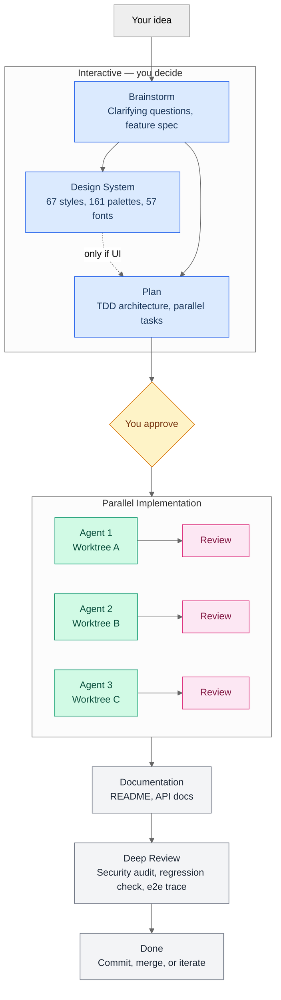
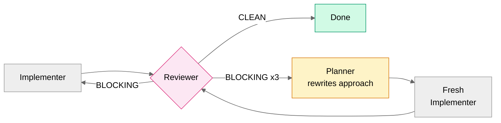

# devline

A Claude Code plugin that runs your entire development lifecycle. Feed it a rough idea, get back merge-ready code with tests, documentation, and a security audit.



Every finding from every review gets fixed. There is no "pass with warnings." If an implementer can't fix it after two attempts, the planner rewrites the approach.

---

## Install

### From the marketplace

```bash
claude plugin add devline
```

### From source (for development)

```bash
git clone https://github.com/devline-io/claude-devline.git
claude --plugin-dir ./claude-devline
```

### Requirements

- Claude Code with plugin support
- `jq` (JSON processing — used by hooks)
- `git`
- [`gh`](https://cli.github.com/) (GitHub CLI — for PR creation)

### Setup

Run `/devline:setup` in your project to create a `CLAUDE.md` and configure pipeline settings interactively.

### Permissions

Devline is built for `--dangerously-skip-permissions` mode. The agents need to read files, write code, and run builds without prompting you on every tool call.

Safety comes from **hooks, not permissions**. The plugin ships 85+ security rules that block destructive operations before they execute — force pushes, `rm -rf` outside the working dir, credential exposure, publishing, and more. See [Security Hooks](#security-hooks) for the full list.

```bash
claude --dangerously-skip-permissions
```

If you prefer the default permission mode, devline still works — you'll just get prompted frequently during parallel implementation.

---

## Commands

| Command | What it does |
|---------|-------------|
| `/devline <idea>` | Full pipeline — brainstorm through deep review |
| `/devline:brainstorm <idea>` | Refine an idea into a feature spec |
| `/devline:plan <spec>` | Create a TDD implementation plan |
| `/devline:implement` | Implement tasks from an existing plan |
| `/devline:review` | In-depth code review of recent changes |
| `/devline:debug <error>` | Systematic root cause analysis |
| `/devline:deep-review` | Final merge-readiness audit |
| `/devline:cve-patcher <CVEs>` | Patch vulnerabilities across repos |
| `/devline:migrate <package>` | Major version migrations with breaking changes |
| `/devline:design` | Standalone component/theme design |
| `/writing` | Write, edit, or translate text without AI patterns |
| `/brand` | Brand voice, visual identity, messaging |
| `/graphic-design` | Logos, icons, banners, slides, corporate identity |

---

## How the Pipeline Works

<details>
<summary><strong>Stage 0: Branch Setup</strong></summary>

Reads branching config from `.claude/devline.local.md`. Creates a feature branch if you're on a protected branch. Sets up the `.devline/` working directory.

</details>

<details>
<summary><strong>Stage 1: Brainstorm</strong> (interactive)</summary>

Focuses on **what** you're building and **where** it fits — not implementation details. Asks 0–4 structured questions with selectable options, then writes `.devline/brainstorm.md` capturing scope, architecture impact, UI impact, and key decisions.

You approve the spec before anything else happens.

</details>

<details>
<summary><strong>Stage 1.5: Design System</strong> (interactive, conditional)</summary>

Runs only when the brainstorm identifies UI impact. The frontend-planner searches a curated database (67 visual styles, 161 color palettes, 57 font pairings, 161 industry rules) and generates HTML previews you can open in your browser to compare directions.

After you pick a direction, it writes a complete design system to `.devline/design-system.md` — color palette with semantic tokens, typography, animation timing, anti-patterns, and accessibility checklist.

</details>

<details>
<summary><strong>Stage 2: Plan</strong> (interactive)</summary>

The planner reads the brainstorm and design system, analyzes your codebase at execution-path depth, and produces a TDD plan with:

- Parallel tasks with file-based isolation (no merge conflicts)
- Dependency graph for execution ordering
- Feature-goal tests that prove the feature works end-to-end
- Integration contracts (observer notifications, lifecycle hooks, state propagation)
- Proactive improvements for code issues discovered during research
- Secondary touchpoint mapping for migrations/redesigns

Writes `.devline/plan.md`. You approve before implementation starts.

</details>

<details>
<summary><strong>Stage 3: Implement + Review</strong> (autonomous, parallel)</summary>

One agent per task, each in its own git worktree. Strict TDD: write a failing test, make it pass, refactor. After each task, a reviewer checks correctness, security, performance, and integration contract compliance.



A build invocation counter (enforced by hook) prevents agents from running expensive commands indefinitely. Agent health monitoring with a 45-minute hard kill serves as a backstop.

</details>

<details>
<summary><strong>Stage 4: Documentation</strong> (autonomous)</summary>

Updates README, API docs, and architecture docs to match the new code.

</details>

<details>
<summary><strong>Stage 5: Deep Review</strong> (autonomous, final gate)</summary>

Security audit, credential scanning, regression check, feature-goal verification (end-to-end trace through actual code paths), cross-task integration sweep, and plan compliance.

**Minor findings** → implementer fixes, reviewer verifies, done.
**Major findings** → implementer → debugger (root cause) → planner (new approach) → restart.

</details>

---

## Agents

| Agent | Model | Role | Max Turns |
|-------|-------|------|-----------|
| Planner | Opus | Architecture, TDD task design, dependency graphs | 70 |
| Frontend-planner | Sonnet | Design system generation from curated database | 50 |
| Implementer | Sonnet | TDD implementation, one task per agent | 45 |
| Reviewer | Sonnet | Correctness, security, performance, integration contracts | 25 |
| Deep-review | Opus | Final gate — security, regressions, e2e verification | 40 |
| Debugger | Opus | Scientific debugging or escalation planning | 40 |
| DevOps | Sonnet | Build systems, CI/CD, Docker, infrastructure | 35 |
| Docs-keeper | Sonnet | README, API docs, architecture docs | 20 |
| Dependency-patcher | Sonnet | CVE patches and version bumps | 25 |
| Dependency-migrator | Opus | Complex migrations with breaking changes | 45 |

---

## State Persistence and Recovery

Long pipelines survive context compaction. All mutable state lives on disk:

| File | Purpose |
|------|---------|
| `.devline/state.md` | Task progress, active agents, launch timestamps |
| `.devline/deferred-findings.md` | Minor review findings queued for batch fix |
| `.devline/agent-log.md` | Agent completion log (written by SubagentStop hook) |
| `.devline/plan.md` | Implementation plan (single source of truth) |

A **PreCompact hook** automatically re-injects the pipeline state into context after compaction — the orchestrator resumes without manual recovery. Absolute timestamps in `state.md` let health monitoring continue after compaction with correct elapsed times.

All `.devline/` artifacts are cleaned up when the pipeline completes. They are never committed — hooks block staging anything under `.devline/`.

---

## Lessons System

Agents discover non-obvious codebase patterns during implementation, review, and debugging. These are persisted to `CLAUDE.md` in your project root as lessons:

```
**Pattern**: [what triggers it] | **Reason**: [why] | **Solution**: [how to prevent it]
```

The planner reads lessons before designing the plan and bakes relevant ones into task constraints. The reviewer and debugger also read lessons at task start. This means past mistakes inform future runs — the pipeline gets smarter over time.

---

## Security Hooks

Devline ships PreToolUse hooks that block dangerous operations before they execute. Designed for `--dangerously-skip-permissions` mode.

<details>
<summary><strong>What's blocked (85+ rules)</strong></summary>

| Category | Examples |
|----------|---------|
| Destructive filesystem | `rm -rf /`, paths outside working dir, non-git directories |
| Git destructive | Force push, hard reset, force clean, stash drop |
| Protected branches | Push, rebase, delete, force create |
| Publishing | `npm publish`, `docker push`, `git tag`, `gh release create` |
| GitHub mutations | `gh pr merge`, `gh pr close`, `gh issue close` |
| Database | `DROP TABLE`, `TRUNCATE`, bulk `DELETE FROM` |
| Credentials | Hardcoded API keys, private keys, JWTs, AWS keys, GitHub tokens |
| External mutations | HTTP POST/PUT/DELETE to non-localhost, SSH, service control |
| Commit format | Conventional commits validation (customizable regex) |
| Build budget | Blocks build/test commands after 12 invocations per task |

</details>

Protected branches default to: main, master, develop, release, production, staging.

---

## Design Intelligence

The frontend-planner searches a curated CSV database using BM25 ranking — not LLM generation. This means consistent, researched recommendations instead of hallucinated color codes.

<details>
<summary><strong>Database contents</strong></summary>

| Domain | Records | Examples |
|--------|---------|---------|
| Visual styles | 67 | Glassmorphism, brutalism, neomorphism, material design |
| Color palettes | 161 | Industry-matched with mood, contrast ratios, dark mode |
| Font pairings | 57 | Google Fonts with mood, weights, CSS imports |
| Industry rules | 161 | SaaS, fintech, healthcare, e-commerce — anti-patterns included |
| Animated components | 160 | Text, scroll, cursor, background, card, navigation, hero, 3D |
| UX guidelines | 99 | Do/Don't with code examples |
| Google Fonts | 1,924 | Full catalog with classifications and variable axes |
| Stack guidelines | 13 | React, Vue, Flutter, SwiftUI, Jetpack Compose, and more |

</details>

Six design modes: full pipeline (brainstorm → design system), showcase (N HTML variations), component (single targeted design), extend (add to existing system), harmonize (match project theme), brand (persistent identity at `design-system/`).

---

## Configuration

Create `.claude/devline.local.md` with YAML frontmatter, or run `/devline:setup` for guided setup. All settings are optional.

### Quick examples

**Auto-approve everything:**
```yaml
---
auto_approve_brainstorm: true
auto_approve_plan: true
---
```

**Jira ticket convention:**
```yaml
---
branch_format: "PROJ-{ticket}/{title}"
branch_kinds: "PROJ"
commit_format: "PROJ-123: description"
commit_format_regex: "^[A-Z]+-[0-9]+: .+"
---
```

**Emoji commits:**
```yaml
---
commit_format: "emoji description"
commit_format_regex: "^(✨|🐛|♻️|📝|🔧|✅|🔨|🚀|⬆️|⏪) .+"
---
```

<details>
<summary><strong>All settings</strong></summary>

#### Approval gates

| Setting | Default | Description |
|---------|---------|-------------|
| `auto_approve_brainstorm` | `false` | Skip approval after brainstorming |
| `auto_approve_plan` | `false` | Skip approval after planning |

#### Branching strategy

| Setting | Default | Description |
|---------|---------|-------------|
| `enforce_feature_branches` | `false` | Block source edits on protected branches |
| `branch_format` | `"{kind}/{title}"` | Branch naming (`{kind}`, `{title}` placeholders) |
| `branch_kinds` | `"feat\|fix\|refactor\|docs\|chore\|test\|ci"` | Allowed branch kinds |
| `protected_branches` | `"(main\|master\|develop\|release\|production\|staging)"` | Protected branches regex |
| `merge_style` | `"squash"` | How to merge into protected: `squash`, `merge`, `rebase` |

#### Commit conventions

| Setting | Default | Description |
|---------|---------|-------------|
| `commit_format` | `"kind(scope): details"` | Human-readable format shown in errors |
| `commit_format_regex` | conventional commits | Regex for validation |

#### Framework overrides

| Setting | Default | Description |
|---------|---------|-------------|
| `test_framework` | auto-detect | e.g., `"vitest"`, `"jest"`, `"pytest"` |
| `frontend_framework` | auto-detect | e.g., `"react"`, `"vue"`, `"svelte"` |
| `doc_format` | auto-detect | e.g., `"markdown"`, `"asciidoc"` |
| `cloud_provider` | auto-detect | e.g., `"aws"`, `"gcp"`, `"azure"` |

#### Dependency management

| Setting | Default | Description |
|---------|---------|-------------|
| `dep_branch_strategy` | `"main"` | `"main"` = default branch, `"branch"` = per-update branch |
| `dep_auto_push` | `true` | Push after verification |
| `dep_auto_commit` | `true` | Commit after verification |
| `dep_verify_build` | `true` | Run build check |
| `dep_verify_tests` | `true` | Run test suite |

CVE patcher uses `cve_` prefix, migrate uses `migrate_` prefix (same keys, independent overrides).

</details>

---

## Tips

- **Review the plan before approving.** The plan drives everything downstream. Push back here, not during implementation.
- **`/clear` between unrelated tasks.** Stale context causes more mistakes than missing context.
- **`/compact` at ~70% context.** The PreCompact hook preserves pipeline state automatically. Pass focus instructions: `/compact Focus on the API changes`.
- **Use `/devline:implement` for well-defined tasks.** Skip brainstorming when you already know exactly what to build.
- **Use `/devline:debug` instead of manual debugging.** The scientific method catches root causes faster.
- **Install [RTK](https://github.com/rtk-ai/rtk) for 60–90% token savings.** A CLI proxy that filters noise from command output. Especially effective with parallel agents. Run `/devline:setup` to install, or `curl -fsSL https://raw.githubusercontent.com/rtk-ai/rtk/refs/heads/master/install.sh | sh && rtk init -g`.

---

## Documentation Lookup

Agents use [Context7](https://context7.com) via `npx ctx7@latest` to fetch current library docs at planning and implementation time. No MCP server needed. For higher rate limits, set `CONTEXT7_API_KEY` or run `npx -y ctx7@latest login`.

---

## License

MIT
